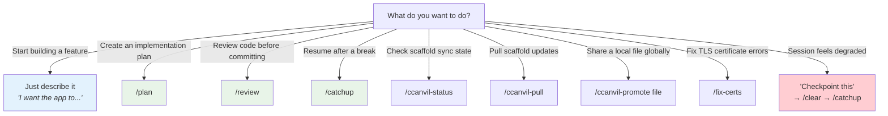
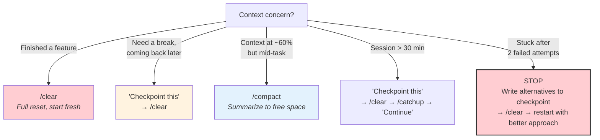
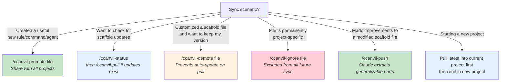

# Decision Guide

## "Should I use a slash command or just talk?"

## "When should I checkpoint vs clear vs compact?"

## "When should I sync with the scaffold?"

<!-- NODE-SPECIFIC-START -->
<!-- Add project-specific content below this line. -->
<!-- Hub content above is updated via /ccanvil-pull. -->
