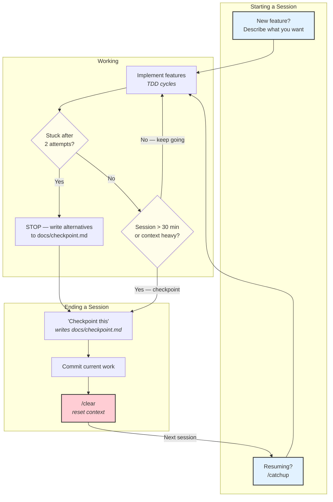

# Session Management

Sessions should be short and focused. The scaffold provides tools for preserving and resuming state.

## What `/catchup` reads

When you run `/catchup` after a `/clear`, Claude reads these sources to orient:

| Source | Purpose |
|--------|---------|
| `docs/checkpoint.md` | What was accomplished, blockers, next steps |
| `git log --oneline -10` | Recent commits |
| `git diff --stat` | Uncommitted changes |
| `git diff --cached --stat` | Staged changes |
| `docs/spec.md` | Current feature specification |

It reports the state but does NOT start implementing. You say "Continue" when ready.

## When to `/clear`

| Situation | Action |
|-----------|--------|
| Finished a feature | `/clear` → start fresh |
| Switching to a different task | Checkpoint → `/clear` → new task |
| Session feels slow or confused | Checkpoint → `/clear` → `/catchup` → "Continue" |
| After ~30 minutes of complex work | Checkpoint → `/clear` → `/catchup` |
| Context at ~60% | `/compact` first, or checkpoint → `/clear` |

**Why aggressive clearing works:** A fresh 30-minute session with clear context outperforms a degraded 3-hour session. Structured prompts preserve 92% fidelity through compaction vs 71% for narrative prompts.

<!-- NODE-SPECIFIC-START -->
<!-- Add project-specific content below this line. -->
<!-- Hub content above is updated via /ccanvil-pull. -->
