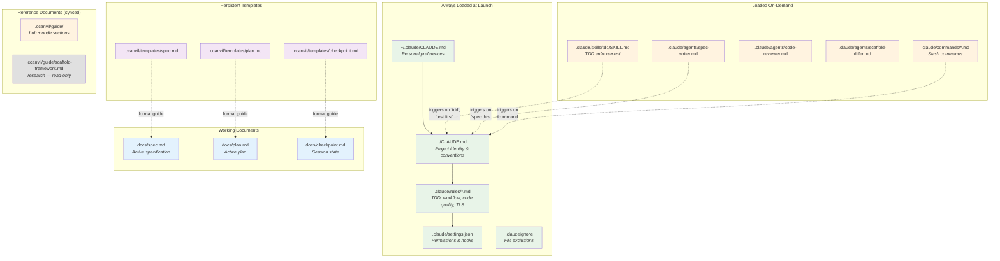

# System Overview

The scaffold is a layered configuration system. Each layer loads at a different time and serves a different purpose.

**Why this layering matters:** Claude has ~150-200 effective instruction slots. The always-loaded layer (CLAUDE.md + rules) should stay under that budget. Everything else loads on-demand to avoid diluting attention. The `.claudeignore` file is the single biggest lever — file reads consume 80% of context.

<!-- NODE-SPECIFIC-START -->
<!-- Add project-specific content below this line. -->
<!-- Hub content above is updated via /ccanvil-pull. -->
