# Claude Code Scaffold — Complete Guide

A visual, browsable guide to the scaffold system: how it works, when to use each feature, and the reasoning behind every design decision.

> **Why this scaffold exists:** Transformer attention is zero-sum. Every token in Claude's ~200K context window competes for attention weight. Performance degrades as context fills — starting at just 3,000 tokens. This scaffold manages that constraint through specification-driven development, test-driven verification, and hierarchical context management. Every feature described below traces back to this architectural reality.

---

## Table of Contents

1. [System Overview](#system-overview)
2. [Getting Started](#getting-started)
3. [The Core Workflow: Spec → Plan → Build → Review](#the-core-workflow)
4. [Session Management](#session-management)
5. [Scaffold Sync System](#scaffold-sync-system)
6. [Command Reference](#command-reference)
7. [Configuration Layers](#configuration-layers)
8. [Decision Guide: When To Use What](#decision-guide)

---

## System Overview

The scaffold is a layered configuration system. Each layer loads at a different time and serves a different purpose.

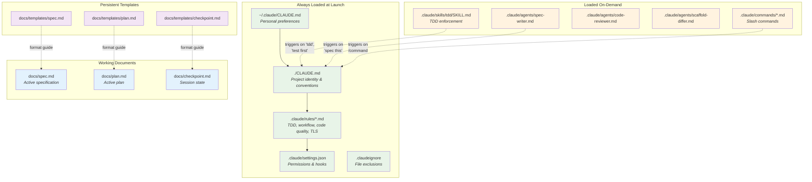

**Why this layering matters:** Claude has ~150-200 effective instruction slots. The always-loaded layer (CLAUDE.md + rules) should stay under that budget. Everything else loads on-demand to avoid diluting attention. The `.claudeignore` file is the single biggest lever — file reads consume 80% of context.

---

## Getting Started

### First-time setup (once per machine)

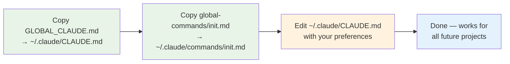

### Starting a new project

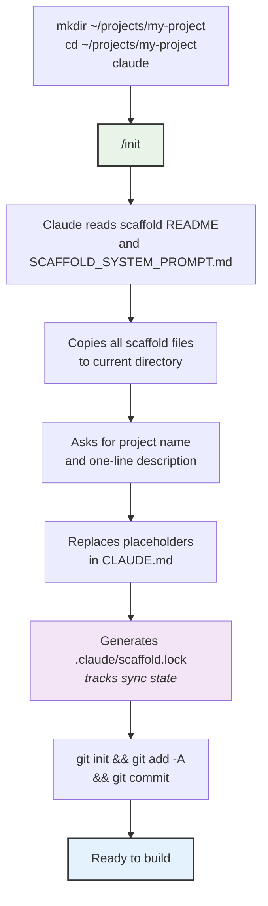

---

## The Core Workflow

Every feature follows this sequence. No exceptions.

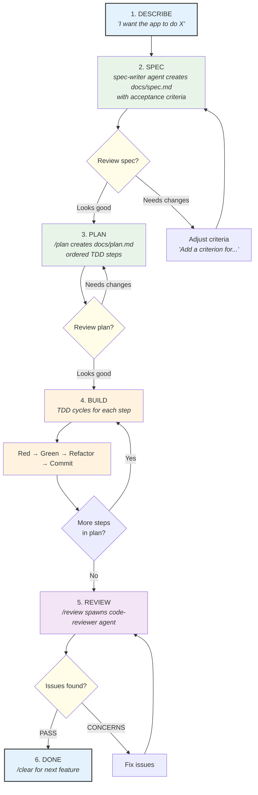

### The TDD Cycle (Step 4 in detail)

Each step in the plan goes through this exact sequence. The TDD skill enforces it automatically.

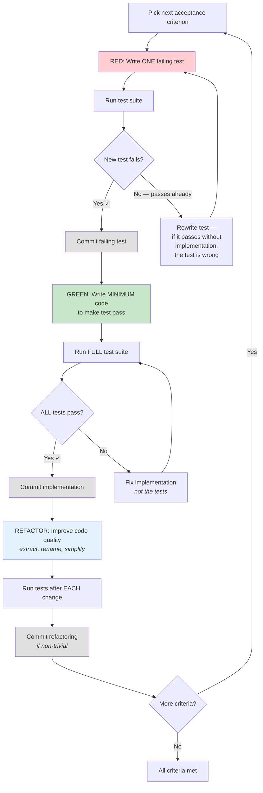

**Why TDD matters here:** Without tests, Claude's only verification is its own judgment — which degrades as context fills. At 80% accuracy per decision, 20 sequential decisions yield 1.2% overall success. Tests provide ground truth that survives context compaction and session resets.

---

## Session Management

Sessions should be short and focused. The scaffold provides tools for preserving and resuming state.

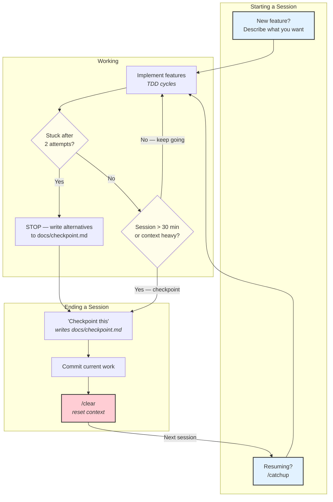

### What `/catchup` reads

When you run `/catchup` after a `/clear`, Claude reads these sources to orient:

| Source | Purpose |
|--------|---------|
| `docs/checkpoint.md` | What was accomplished, blockers, next steps |
| `git log --oneline -10` | Recent commits |
| `git diff --stat` | Uncommitted changes |
| `git diff --cached --stat` | Staged changes |
| `docs/spec.md` | Current feature specification |

It reports the state but does NOT start implementing. You say "Continue" when ready.

### When to `/clear`

| Situation | Action |
|-----------|--------|
| Finished a feature | `/clear` → start fresh |
| Switching to a different task | Checkpoint → `/clear` → new task |
| Session feels slow or confused | Checkpoint → `/clear` → `/catchup` → "Continue" |
| After ~30 minutes of complex work | Checkpoint → `/clear` → `/catchup` |
| Context at ~60% | `/compact` first, or checkpoint → `/clear` |

**Why aggressive clearing works:** A fresh 30-minute session with clear context outperforms a degraded 3-hour session. Structured prompts preserve 92% fidelity through compaction vs 71% for narrative prompts.

---

## Scaffold Sync System

The scaffold is a hub with downstream project nodes. The sync system enables bi-directional flow of configuration.

### Architecture

```mermaid
graph TB
    subgraph HUB["Scaffold Hub<br/>~/projects/claude-code-scaffold"]
        H_RULES["rules/"]
        H_CMD["commands/"]
        H_AGENTS["agents/"]
        H_SKILLS["skills/"]
        H_TEMPLATES["docs/templates/"]
        H_SCRIPTS["scripts/"]
        CHANGELOG["SCAFFOLD_CHANGELOG.md"]
    end

    subgraph NODE["Downstream Project (e.g. fucina)"]
        N_RULES["rules/<br/><i>global + local</i>"]
        N_CMD["commands/<br/><i>global + local</i>"]
        N_AGENTS["agents/"]
        N_SKILLS["skills/"]
        N_TEMPLATES["docs/templates/"]
        N_SCRIPTS["scripts/"]
        LOCK[".claude/scaffold.lock<br/><i>provenance manifest</i>"]
        SYNCLOG[".claude/scaffold-sync.log"]
    end

    H_RULES <-->|"sync"| N_RULES
    H_CMD <-->|"sync"| N_CMD
    H_AGENTS <-->|"sync"| N_AGENTS
    H_SKILLS <-->|"sync"| N_SKILLS
    H_TEMPLATES <-->|"sync"| N_TEMPLATES
    H_SCRIPTS <-->|"sync"| N_SCRIPTS

    LOCK -.->|"tracks state"| N_RULES
    LOCK -.->|"tracks state"| N_CMD

    style HUB fill:#e8f4e8,stroke:#333,stroke-width:2px
    style NODE fill:#e3f2fd,stroke:#333,stroke-width:2px
    style LOCK fill:#f3e5f5
    style CHANGELOG fill:#fff3e0
    style SYNCLOG fill:#fff3e0
```

### File Status Lifecycle

Every tracked file has a status in the lockfile. Status determines what happens during pull/push.

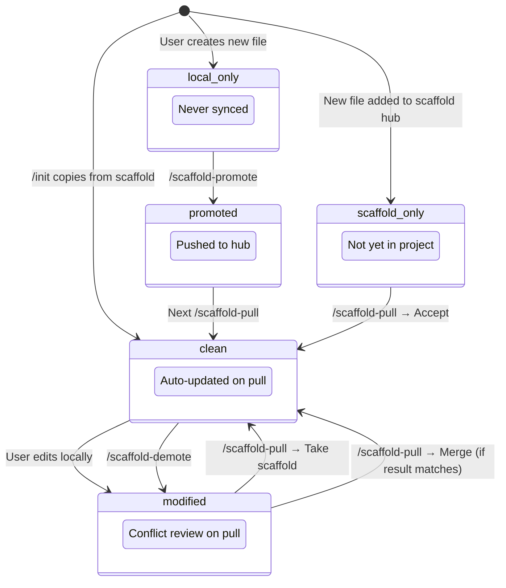

### Pull Flow (Hub → Project)

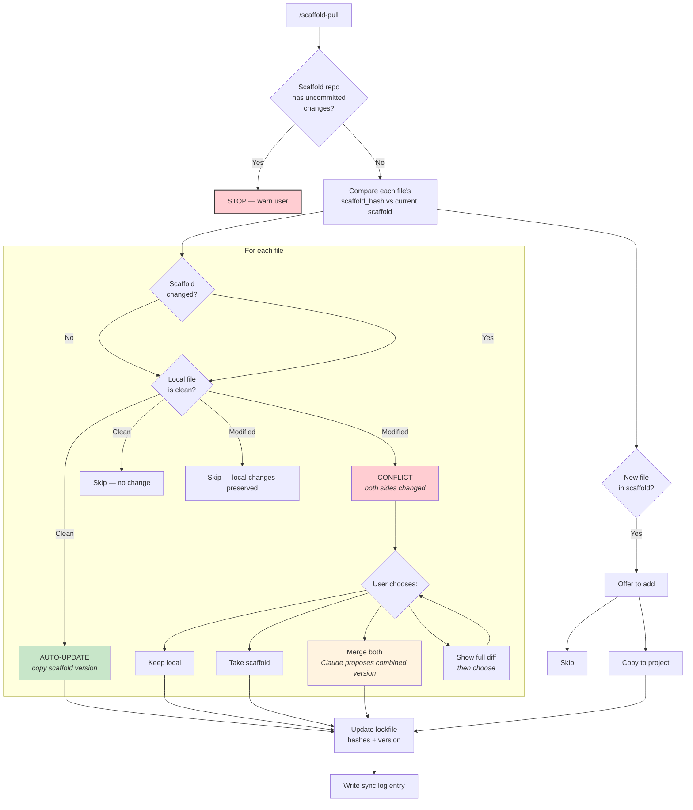

### Push Flow (Project → Hub)

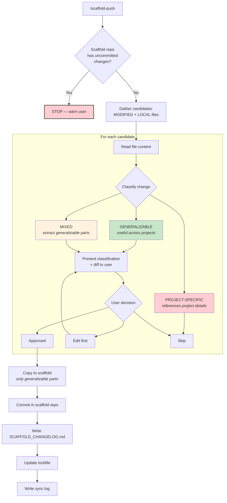

### Promote and Demote

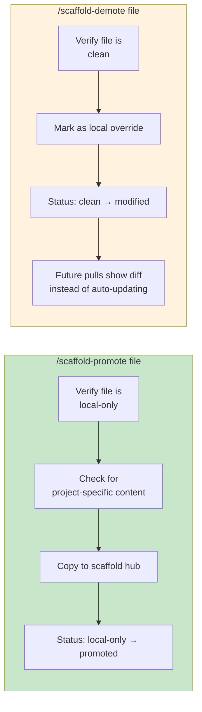

---

## Command Reference

### Feature Development Commands

| Command | Phase | What it does | Files affected |
|---------|-------|-------------|----------------|
| *"Describe feature"* | Spec | Triggers spec-writer agent | Writes `docs/spec.md` |
| `/plan` | Plan | Creates ordered TDD steps from spec | Writes `docs/plan.md` |
| *"Start building"* | Build | Enters TDD cycle | Source + test files |
| `/review` | Review | Spawns code-reviewer sub-agent | None (read-only) |

### Session Management Commands

| Command | When | What it does |
|---------|------|-------------|
| `/catchup` | After `/clear` | Reads checkpoint + git state, reports status |
| *"Checkpoint this"* | Pausing work | Writes state to `docs/checkpoint.md`, commits |
| `/clear` | Between tasks | Resets context (built-in) |
| `/compact` | Context heavy | Summarizes context to free space (built-in) |
| `/cost` | Monitoring | Shows token usage (built-in) |

### Scaffold Sync Commands

| Command | Direction | What it does |
|---------|-----------|-------------|
| `/scaffold-status` | Read-only | Shows sync state of all tracked files |
| `/scaffold-pull` | Hub → Project | Pulls updates, resolves conflicts |
| `/scaffold-push` | Project → Hub | Pushes generalizable changes upstream |
| `/scaffold-promote <file>` | Project → Hub | Promotes a local file to the scaffold |
| `/scaffold-demote <file>` | Local | Marks a scaffold file as local override |

### Utility Commands

| Command | What it does |
|---------|-------------|
| `/fix-certs` | Diagnoses and repairs Cloudflare WARP TLS certificate issues |
| `/init` | Initializes a new project from the scaffold (global command) |

---

## Configuration Layers

### What goes where

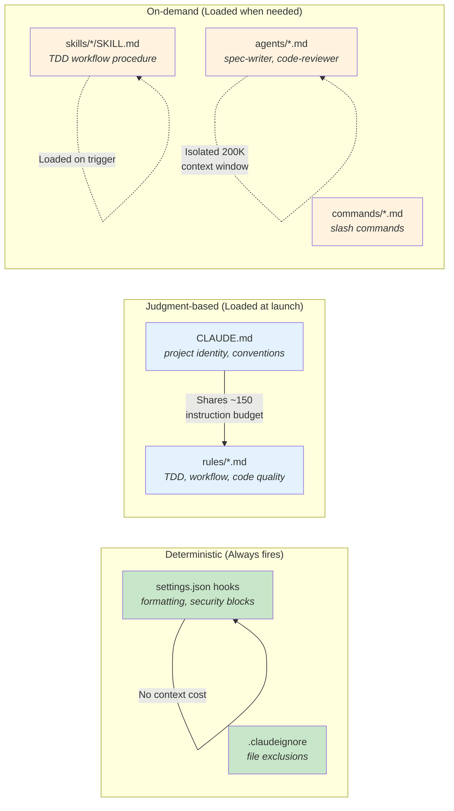

**The principle:** Use hooks for things that must ALWAYS happen (formatting, security). Use rules and CLAUDE.md for things requiring judgment (coding patterns, conventions). Use skills/agents for workflows that only activate sometimes.

### Hooks (settings.json)

| Hook | Event | What it does |
|------|-------|-------------|
| Security blocker | Pre-write | Blocks writes to `.env`, `*credentials*`, `*secret*` files |
| Auto-format | Post-write | Runs formatter (commented out — uncomment for your project) |

### Rules (loaded at launch)

| Rule file | Concern | Key behaviors enforced |
|-----------|---------|----------------------|
| `tdd.md` | Testing | Red-green-refactor cycle, test naming, fix implementation not tests |
| `workflow.md` | Sessions | One objective per session, checkpoint, delegate research, stop after 2 failures |
| `code-quality.md` | Code | Follow existing patterns, typed errors, pin dependencies, intent-revealing names |
| `tls-troubleshooting.md` | Certs | Auto-detect WARP cert errors, fix with CA bundle, never disable TLS |

---

## Decision Guide

### "Should I use a slash command or just talk?"

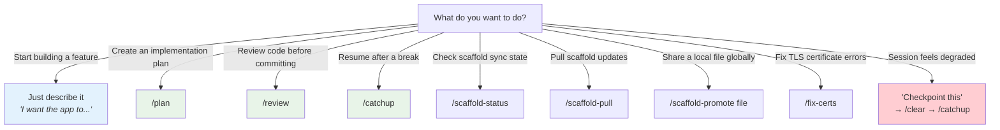

### "When should I checkpoint vs clear vs compact?"

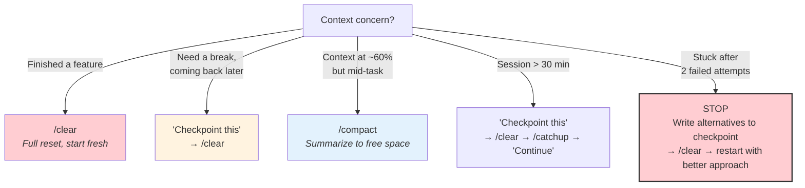

### "When should I sync with the scaffold?"

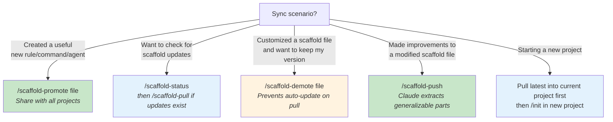

---

## Appendix: Why Each Practice Exists

Every scaffold feature traces back to transformer architecture research. This table maps features to their underlying justification from `SCAFFOLD_FRAMEWORK.md`.

| Practice | Research basis |
|----------|--------------|
| CLAUDE.md under 80 lines | U-shaped attention: models attend to beginning/end, lose the middle. ~150-200 effective instruction slots. |
| TDD verification loops | Without tests, 80% accuracy per decision × 20 decisions = 1.2% overall success. Tests provide external oracle. |
| Spec before code | "Instruction loss" is the primary bottleneck — models lose track of earlier requirements when multiple features specified together. |
| Short sessions + `/clear` | Performance degrades starting at 3,000 tokens. Even with 100% perfect retrieval, accuracy drops 13-85% as input grows. |
| Sub-agents for research | Isolated 200K context windows. Only summaries return. Keeps main session focused on implementation. |
| `.claudeignore` exclusions | File reads consume 80% of context. Excluding irrelevant files is the biggest single lever. |
| Hooks for formatting | Never send an LLM to do a linter's job. Deterministic tools handle formatting perfectly without consuming instruction budget. |
| Progressive disclosure (`@path`) | Loading detailed docs on-demand prevents attention dilution. Every token competes; don't load what isn't needed now. |
| Templates separate from active docs | Format guides persist as scaffold resources; active docs are overwritten freely. Agents always have the format reference available. |
| Scaffold sync with lockfile | Configuration inheritance with provenance tracking. Enables knowledge reuse across projects while respecting local customization. |
