# Claude Code Scaffold — Complete Guide

A visual, browsable guide to the scaffold system: how it works, when to use each feature, and the reasoning behind every design decision.

> **Why this scaffold exists:** Transformer attention is zero-sum. Every token in Claude's ~200K context window competes for attention weight. Performance degrades as context fills — starting at just 3,000 tokens. This scaffold manages that constraint through specification-driven development, test-driven verification, and hierarchical context management. Every feature described below traces back to this architectural reality.

---

## Table of Contents

1. [System Overview](#system-overview)
2. [Getting Started](#getting-started)
3. [The Core Workflow: Spec → Plan → Build → Review](#the-core-workflow)
4. [Session Management](#session-management)
5. [Scaffold Sync System](#scaffold-sync-system)
6. [Command Reference](#command-reference)
7. [Configuration Layers](#configuration-layers)
8. [Hooks System](#hooks-system)
9. [Decision Guide: When To Use What](#decision-guide)

---

## System Overview

The scaffold is a layered configuration system. Each layer loads at a different time and serves a different purpose.

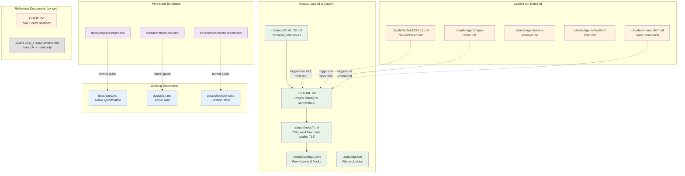

**Why this layering matters:** Claude has ~150-200 effective instruction slots. The always-loaded layer (CLAUDE.md + rules) should stay under that budget. Everything else loads on-demand to avoid diluting attention. The `.claudeignore` file is the single biggest lever — file reads consume 80% of context.

---

## Getting Started

### First-time setup (once per machine)

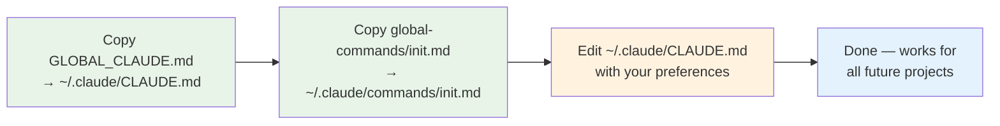

### Starting a new project

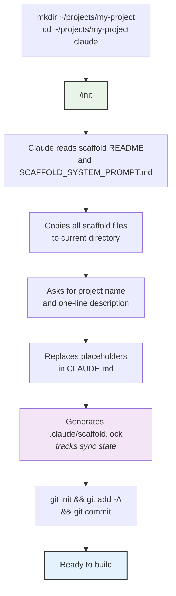

---

## The Core Workflow

Every feature follows this sequence. No exceptions.

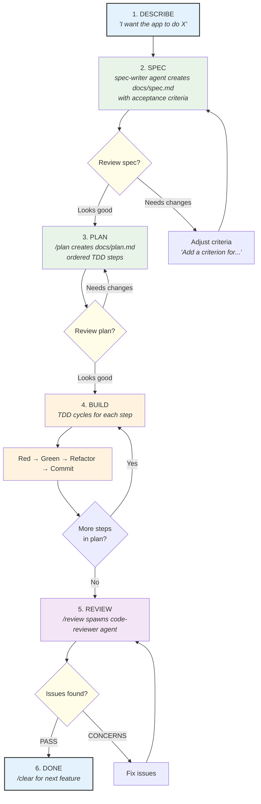

### The TDD Cycle (Step 4 in detail)

Each step in the plan goes through this exact sequence. The TDD skill enforces it automatically.

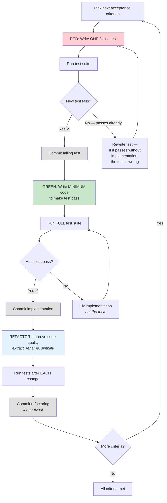

**Why TDD matters here:** Without tests, Claude's only verification is its own judgment — which degrades as context fills. At 80% accuracy per decision, 20 sequential decisions yield 1.2% overall success. Tests provide ground truth that survives context compaction and session resets.

---

## Session Management

Sessions should be short and focused. The scaffold provides tools for preserving and resuming state.

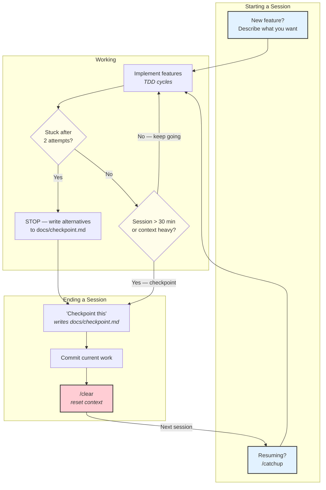

### What `/catchup` reads

When you run `/catchup` after a `/clear`, Claude reads these sources to orient:

| Source | Purpose |
|--------|---------|
| `docs/checkpoint.md` | What was accomplished, blockers, next steps |
| `git log --oneline -10` | Recent commits |
| `git diff --stat` | Uncommitted changes |
| `git diff --cached --stat` | Staged changes |
| `docs/spec.md` | Current feature specification |

It reports the state but does NOT start implementing. You say "Continue" when ready.

### When to `/clear`

| Situation | Action |
|-----------|--------|
| Finished a feature | `/clear` → start fresh |
| Switching to a different task | Checkpoint → `/clear` → new task |
| Session feels slow or confused | Checkpoint → `/clear` → `/catchup` → "Continue" |
| After ~30 minutes of complex work | Checkpoint → `/clear` → `/catchup` |
| Context at ~60% | `/compact` first, or checkpoint → `/clear` |

**Why aggressive clearing works:** A fresh 30-minute session with clear context outperforms a degraded 3-hour session. Structured prompts preserve 92% fidelity through compaction vs 71% for narrative prompts.

---

## Scaffold Sync System

The scaffold is a hub with downstream project nodes. The sync system enables bi-directional flow of configuration.

### Architecture

```mermaid
graph TB
    subgraph HUB["Scaffold Hub<br/>~/projects/claude-code-scaffold"]
        H_RULES["rules/"]
        H_CMD["commands/"]
        H_AGENTS["agents/"]
        H_SKILLS["skills/"]
        H_TEMPLATES["docs/templates/"]
        H_SCRIPTS["scripts/"]
        H_GUIDE["GUIDE.md<br/><i>hub section</i>"]
        H_CLAUDE["CLAUDE.md<br/><i>hub methodology</i>"]
        H_FRAMEWORK["SCAFFOLD_FRAMEWORK.md<br/><i>research — read-only</i>"]
        CHANGELOG["SCAFFOLD_CHANGELOG.md"]
    end

    subgraph NODE["Downstream Project (e.g. fucina)"]
        N_RULES["rules/<br/><i>global + local</i>"]
        N_CMD["commands/<br/><i>global + local</i>"]
        N_AGENTS["agents/"]
        N_SKILLS["skills/"]
        N_TEMPLATES["docs/templates/"]
        N_SCRIPTS["scripts/"]
        N_GUIDE["GUIDE.md<br/><i>hub + node sections</i>"]
        N_CLAUDE["CLAUDE.md<br/><i>node identity + hub methodology</i>"]
        N_FRAMEWORK["SCAFFOLD_FRAMEWORK.md<br/><i>read-only copy</i>"]
        LOCK[".claude/scaffold.lock<br/><i>provenance manifest</i>"]
        SYNCLOG[".claude/scaffold-sync.log"]
    end

    H_RULES <-->|"sync"| N_RULES
    H_CMD <-->|"sync"| N_CMD
    H_AGENTS <-->|"sync"| N_AGENTS
    H_SKILLS <-->|"sync"| N_SKILLS
    H_TEMPLATES <-->|"sync"| N_TEMPLATES
    H_SCRIPTS <-->|"sync"| N_SCRIPTS
    H_GUIDE -->|"section-merge"| N_GUIDE
    H_CLAUDE -->|"section-merge"| N_CLAUDE
    H_FRAMEWORK -->|"auto-update"| N_FRAMEWORK

    LOCK -.->|"tracks state"| N_RULES
    LOCK -.->|"tracks state"| N_CMD

    style HUB fill:#e8f4e8,stroke:#333,stroke-width:2px
    style NODE fill:#e3f2fd,stroke:#333,stroke-width:2px
    style LOCK fill:#f3e5f5
    style CHANGELOG fill:#fff3e0
    style SYNCLOG fill:#fff3e0
    style H_GUIDE fill:#fff3e0
    style H_CLAUDE fill:#fff3e0
    style H_FRAMEWORK fill:#e0e0e0
    style N_GUIDE fill:#fff3e0
    style N_CLAUDE fill:#fff3e0
    style N_FRAMEWORK fill:#e0e0e0
```

### File Status Lifecycle

Every tracked file has a status in the lockfile. Status determines what happens during pull/push.

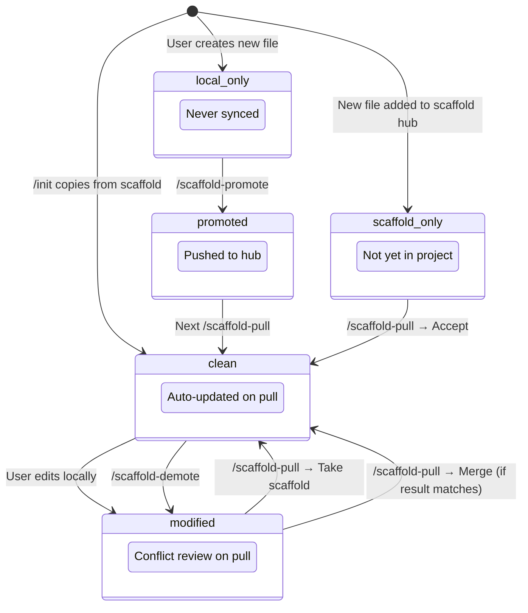

### Pull Flow (Hub → Project)

Every step is handled by a script command except conflict merge proposals, which require Claude's semantic understanding.

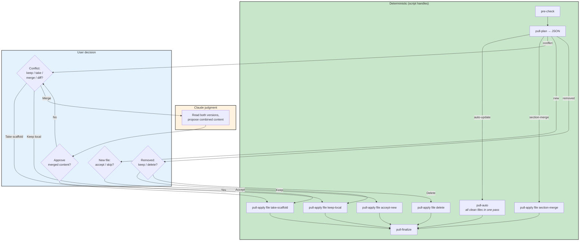

### Push Flow (Project → Hub)

Every step is handled by a script command except change classification, which requires Claude's semantic understanding.

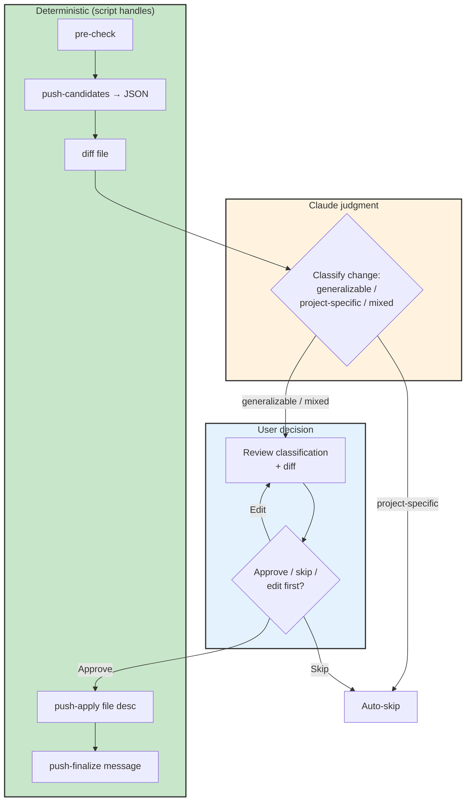

### Promote and Demote

Demote is fully deterministic. Promote has one judgment call: checking for project-specific content.

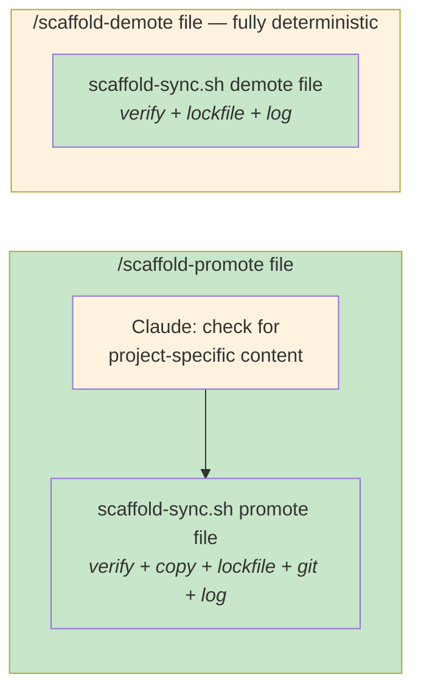

### Document Inheritance (Section-Merge)

Three root-level documents are tracked by the sync system with special merge behavior:

| File | Sync behavior | Hub content | Node content |
|------|--------------|-------------|--------------|
| `SCAFFOLD_FRAMEWORK.md` | Standard auto-update | Entire file (research source material) | None — identical everywhere |
| `GUIDE.md` | Section-merge | Documentation, diagrams, tables (above delimiter) | Project-specific features (below delimiter) |
| `CLAUDE.md` | Section-merge | Workflow, conventions, reference docs, do-not rules (below delimiter) | Project name, tech stack, commands, architecture (above delimiter) |

**How section-merge works:**

Files with delimiters have a hub-managed section and a node-specific section. During `/scaffold-pull`, the hub section is updated from the scaffold while the node section is preserved intact.

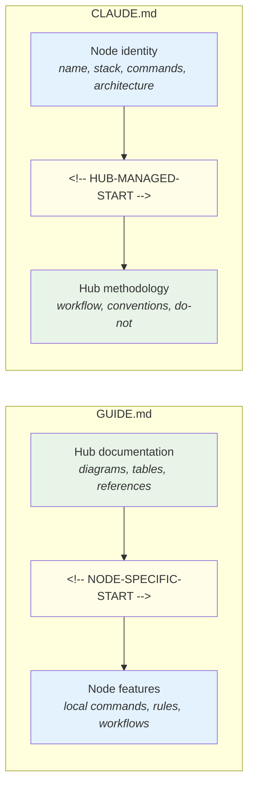

**During `/scaffold-pull`:**
- **GUIDE.md:** Hub section (above delimiter) is replaced with scaffold's version. Node section (below) is untouched.
- **CLAUDE.md:** Node section (above delimiter) is untouched. Hub section (below) is replaced with scaffold's version.
- **SCAFFOLD_FRAMEWORK.md:** Auto-updated as a whole file (no delimiter, no node content).

**During `/scaffold-push`:** Node sections are always classified as project-specific and never pushed upstream.

**Legacy projects without delimiters:** The `section-merge` command gracefully handles files that don't have a delimiter yet — it treats the entire local file as node content and adds the hub section from the scaffold.

---

## Command Reference

### Feature Development Commands

| Command | Phase | What it does | Files affected |
|---------|-------|-------------|----------------|
| *"Describe feature"* | Spec | Triggers spec-writer agent | Writes `docs/spec.md` |
| `/plan` | Plan | Creates ordered TDD steps from spec | Writes `docs/plan.md` |
| *"Start building"* | Build | Enters TDD cycle | Source + test files |
| `/review` | Review | Spawns code-reviewer sub-agent | None (read-only) |

### Session Management Commands

| Command | When | What it does |
|---------|------|-------------|
| `/catchup` | After `/clear` | Reads checkpoint + git state, reports status |
| *"Checkpoint this"* | Pausing work | Writes state to `docs/checkpoint.md`, commits |
| `/clear` | Between tasks | Resets context (built-in) |
| `/compact` | Context heavy | Summarizes context to free space (built-in) |
| `/cost` | Monitoring | Shows token usage (built-in) |

### Scaffold Sync Commands

| Command | Direction | What it does |
|---------|-----------|-------------|
| `/scaffold-status` | Read-only | Shows sync state of all tracked files |
| `/scaffold-pull` | Hub → Project | Pulls updates, resolves conflicts |
| `/scaffold-push` | Project → Hub | Pushes generalizable changes upstream |
| `/scaffold-promote <file>` | Project → Hub | Promotes a local file to the scaffold |
| `/scaffold-demote <file>` | Local | Marks a scaffold file as local override |

### Utility Commands

| Command | What it does |
|---------|-------------|
| `/fix-certs` | Diagnoses and repairs Cloudflare WARP TLS certificate issues |
| `/init` | Initializes a new project from the scaffold (global command) |

---

## Configuration Layers

### What goes where

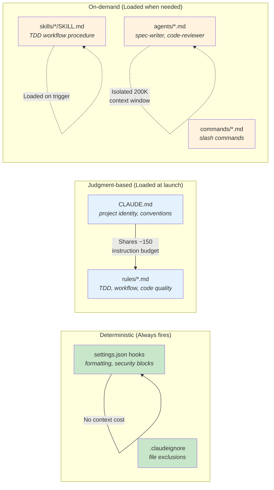

**The principle:** Use hooks for things that must ALWAYS happen (formatting, security). Use rules and CLAUDE.md for things requiring judgment (coding patterns, conventions). Use skills/agents for workflows that only activate sometimes. See the [Deterministic-First rule](#deterministic-first-principle) for the full hierarchy.

### Hooks (`.claude/hooks/`)

Hook scripts live in `.claude/hooks/` and are referenced from `settings.json`. They receive JSON on stdin and control behavior via exit codes.

| Hook | Event | Script | What it does |
|------|-------|--------|-------------|
| File protection | PreToolUse (Write\|Edit\|MultiEdit) | `protect-files.sh` | Blocks writes to `.env`, credentials, `SCAFFOLD_FRAMEWORK.md`, `node_modules/`, `dist/`, `generated/` |
| Auto-format | PostToolUse (Write\|Edit\|MultiEdit) | `format-on-write.sh` | Runs project formatter (uncomment for your stack: Prettier, Black, gofmt, etc.) |

### Rules (loaded at launch)

| Rule file | Concern | Key behaviors enforced |
|-----------|---------|----------------------|
| `deterministic-first.md` | Architecture | Use scripts/hooks over Claude reasoning for computable operations; hierarchy: hook → script → slash command → pure reasoning |
| `tdd.md` | Testing | Red-green-refactor cycle, test naming, fix implementation not tests |
| `workflow.md` | Sessions | One objective per session, checkpoint, delegate research, stop after 2 failures |
| `code-quality.md` | Code | Follow existing patterns, typed errors, pin dependencies, intent-revealing names |
| `tls-troubleshooting.md` | Certs | Auto-detect WARP cert errors, fix with CA bundle, never disable TLS |

---

## Hooks System

Hooks are deterministic automation that runs at Claude Code lifecycle events — outside the reasoning loop, at zero context cost. They are the foundation of the [deterministic-first principle](#deterministic-first-principle).

> **Reference:** See `docs/templates/hooks-reference.md` for the complete hook specification including JSON schemas, all event types, and writing conventions.

### How Hooks Work

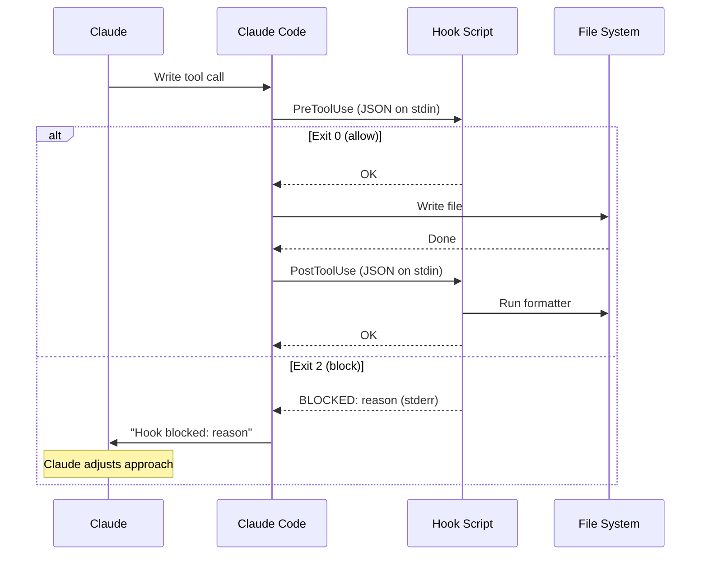

### Deterministic-First Principle

Every operation falls somewhere on the deterministic-stochastic spectrum. The scaffold enforces this hierarchy:

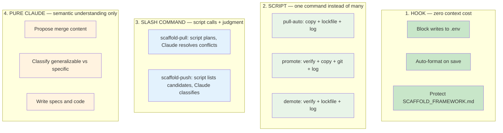

**The test:** "Can this step produce a wrong answer?" If no → it belongs in a script or hook, not Claude's reasoning.

### Hook vs Rule vs Skill

| Situation | Mechanism | Why |
|-----------|-----------|-----|
| "Never write to .env files" | **Hook** (PreToolUse, exit 2) | Binary file path check, zero context cost |
| "Always format code after writing" | **Hook** (PostToolUse) | Deterministic formatter, zero context cost |
| "Protect SCAFFOLD_FRAMEWORK.md" | **Hook** (PreToolUse, exit 2) | Binary check, enforced even if Claude forgets the rule |
| "Follow existing code patterns" | **Rule** | Requires semantic understanding of codebase |
| "Don't add unnecessary dependencies" | **Rule** | Requires judgment about "unnecessary" |
| "Run TDD red-green-refactor cycle" | **Skill** | Multi-step workflow with verification |

### Active Hooks

| Script | Event | Exit 2 blocks | What it checks |
|--------|-------|---------------|----------------|
| `protect-files.sh` | PreToolUse | Yes | `.env`, `*credentials*`, `*secret*`, `*.pem`, `*.key`, `SCAFFOLD_FRAMEWORK.md`, `node_modules/`, `dist/`, `generated/`, `.git/` |
| `format-on-write.sh` | PostToolUse | No | Detects file type, runs appropriate formatter (uncomment for your stack) |

### Adding a New Hook

1. Create script in `.claude/hooks/` (use `protect-files.sh` as template)
2. `chmod +x .claude/hooks/my-hook.sh`
3. Add entry to `.claude/settings.json` under the appropriate event
4. Test: `echo '{"tool_input":{"file_path":"test.env"}}' | .claude/hooks/my-hook.sh; echo "exit: $?"`
5. Update this section and `docs/templates/hooks-reference.md`

---

## Decision Guide

### "Should I use a slash command or just talk?"

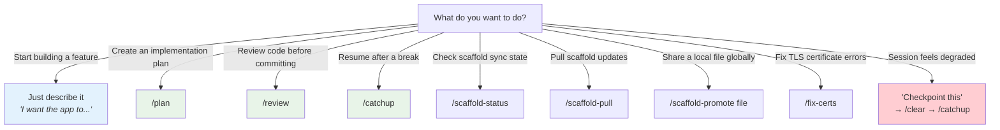

### "When should I checkpoint vs clear vs compact?"

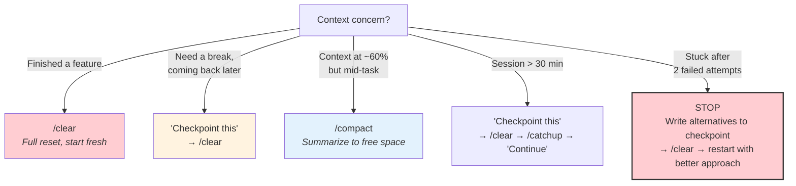

### "When should I sync with the scaffold?"

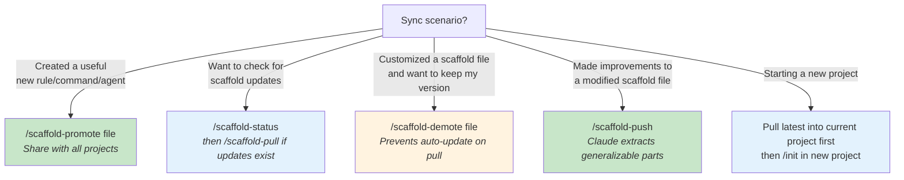

---

## Appendix: Why Each Practice Exists

Every scaffold feature traces back to transformer architecture research. This table maps features to their underlying justification from `SCAFFOLD_FRAMEWORK.md`.

| Practice | Research basis |
|----------|--------------|
| Deterministic-first principle | Every token Claude spends on a deterministic operation (cp, diff, hash, lockfile update) is a token stolen from judgment calls that need a transformer. Computable operations must be scripts/hooks. |
| Hooks over rules for binary checks | Hooks run outside the context window at zero cost. Rules consume instruction slots and can be forgotten under context pressure. Hooks enforce unconditionally. |
| Compound script commands | One `pull-auto` call replaces 4-6 manual commands per file (cp + hash + lock-update ×3 + log). Reduces context burn by ~70% during sync operations. |
| CLAUDE.md under 80 lines | U-shaped attention: models attend to beginning/end, lose the middle. ~150-200 effective instruction slots. |
| TDD verification loops | Without tests, 80% accuracy per decision × 20 decisions = 1.2% overall success. Tests provide external oracle. |
| Spec before code | "Instruction loss" is the primary bottleneck — models lose track of earlier requirements when multiple features specified together. |
| Short sessions + `/clear` | Performance degrades starting at 3,000 tokens. Even with 100% perfect retrieval, accuracy drops 13-85% as input grows. |
| Sub-agents for research | Isolated 200K context windows. Only summaries return. Keeps main session focused on implementation. |
| `.claudeignore` exclusions | File reads consume 80% of context. Excluding irrelevant files is the biggest single lever. |
| Hooks for formatting | Never send an LLM to do a linter's job. Deterministic tools handle formatting perfectly without consuming instruction budget. |
| Progressive disclosure (`@path`) | Loading detailed docs on-demand prevents attention dilution. Every token competes; don't load what isn't needed now. |
| Templates separate from active docs | Format guides persist as scaffold resources; active docs are overwritten freely. Agents always have the format reference available. |
| Scaffold sync with lockfile | Configuration inheritance with provenance tracking. Enables knowledge reuse across projects while respecting local customization. |
| Section-merge for CLAUDE.md/GUIDE.md | Hub methodology and documentation sync to nodes without overwriting project-specific identity and local features. |
| SCAFFOLD_FRAMEWORK.md protection | Research source material is foundational — changes only under paradigm shifts, preserving the reasoning behind every design decision. |

<!-- NODE-SPECIFIC-START -->
<!-- Everything above is managed by the scaffold hub and updated via /scaffold-pull. -->
<!-- Everything below is specific to this project. Add project-specific commands, rules, workflows here. -->

## Project-Specific Features

### Commands

| Command | What it does |
|---------|-------------|
| `/new-component` | Guided workflow for onboarding a new hardware component. Researches specs from official documentation, populates `docs/component-specs.yaml` with physical dimensions, updates inventory and wiring patterns, checks for renderer support, creates a complete sketch with wiring diagram, and validates against specs. |

### Rules

| Rule file | Concern | Key behaviors |
|-----------|---------|---------------|
| `components.md` | Component integration | Check inventory before coding, add missing entries, verify pin conflicts, use correct renderer types in wiring.yaml |
| `sketches.md` | Sketch creation | Every sketch needs 5 files (wiring.yaml, wiring.svg, platformio.ini, src/main.cpp, README.md), write wiring.yaml first, pins must match between yaml and code |

### Reference Documents

| Document | Purpose |
|----------|---------|
| `docs/component-specs.yaml` | Machine-readable physical dimensions for all breadboard components (single source of truth for renderers) |
| `docs/renderers.md` | Maps component types to breadboard.py renderer names and wiring.yaml schema |
| `docs/course-map.md` | Maps Crafting Table course lessons to local sketches with coverage stats |
| `docs/inventory.md` | Full component list with specs, pinouts, libraries, and safety notes |
