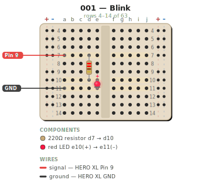
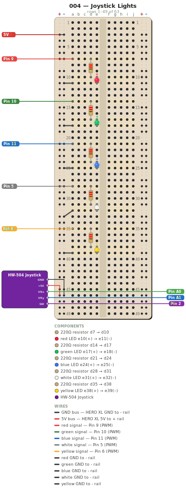

<h1 align="center">
  <br>
  fucina
  <br>
</h1>

<p align="center">
  <strong>An Arduino learning forge with diagram-as-code tooling</strong>
</p>

<p align="center">
  <a href="#quick-start">Quick Start</a> &middot;
  <a href="#sketches">Sketches</a> &middot;
  <a href="#tooling">Tooling</a> &middot;
  <a href="#project-structure">Structure</a>
</p>

<p align="center">
  
  
  
  
</p>

---

**fucina** (Italian for *forge*) is a hands-on Arduino learning platform. Each sketch is a self-contained project with source code, a machine-readable circuit description, and a generated breadboard diagram — so you always know exactly where every wire goes.

<table>
<tr>
<td width="50%">

### Blink (001)

Digital output — LED on/off at 1 Hz



</td>
<td width="50%">

### Joystick Lights (004)

Analog input — 5 LEDs with direction-based effects



</td>
</tr>
</table>

## Quick Start

**Prerequisites:** [PlatformIO Core](https://docs.platformio.org/en/latest/core/installation/methods/index.html) and Python 3

```bash
# Clone and enter
git clone https://github.com/goldhaxx/fucina.git
cd fucina

# Build the first sketch
cd sketches/001-blink
pio run

# Upload to board (connect HERO XL via USB first)
pio run -t upload

# Watch serial output
pio device monitor
```

Each sketch directory is a standalone PlatformIO project. Open any sketch in VS Code with the PlatformIO extension, or use the CLI as shown above.

## Sketches

### Original Series

Progressive projects that build on each other — start with 001 and work through in order.

| # | Name | Concepts | Components |
|---|------|----------|------------|
| [001](sketches/001-blink/) | **Blink** | `digitalWrite`, timing | LED, resistor |
| [002](sketches/002-pulse/) | **Pulse** | `analogWrite`, PWM | LED, resistor |
| [003](sketches/003-patterns/) | **Patterns** | Arrays, serial input, power distribution | 5 LEDs, resistors |
| [004](sketches/004-joystick-lights/) | **Joystick Lights** | Analog read, direction detection, dynamic effects | 5 LEDs, HW-504 joystick |

Each sketch includes:
- `src/main.cpp` — Arduino source
- `wiring.yaml` — machine-readable circuit description
- `wiring.svg` — generated breadboard diagram
- `platformio.ini` — build configuration
- `README.md` — parts list, step-by-step wiring, how it works

### Course Archive (32 sketches)

Extracted from the [Crafting Table Adventure Kit](https://inventr.io/) curriculum, covering sensors, displays, actuators, and communication protocols.

<details>
<summary>Full list</summary>

| Category | Sketches |
|----------|----------|
| **Input** | Push button, potentiometer, photoresistor, joystick, keypad, rotary encoder, IR receiver |
| **Output** | Active buzzer, passive buzzer, RGB LED, servo, stepper motor |
| **Sensors** | Ultrasonic range, PIR motion, sound, gyroscope, rain, DHT (temp/humidity) |
| **Displays** | 7-segment (1 & 4 digit), LCD1602 |
| **Projects** | Alarm clock, plant monitor, clap-activated lights, keypad lock, radar sweep, security motion detector |
| **Communication** | RFID, RTC (real-time clock), WiFi-controlled lights |

</details>

## Tooling

### Breadboard Diagram Generator

The core tool: define your circuit in YAML, get a pixel-accurate SVG breadboard diagram.

```bash
# Generate a diagram
python3 tools/breadboard.py sketches/001-blink/wiring.yaml -o sketches/001-blink/wiring.svg

# Render only rows 1-20
python3 tools/breadboard.py sketches/001-blink/wiring.yaml --rows 1-20 -o out.svg
```

Circuits are defined in `wiring.yaml`:

```yaml
name: "001 — Blink"
board: hero-xl

components:
  - type: resistor
    model: axial-resistor-1/4W
    value: 220
    from: d7
    to: d10

  - type: led
    model: led-5mm
    color: red
    anode: e10
    cathode: e11

wires:
  - from: a7
    to: pin9
    color: "#e53935"
    label: "signal — Pin 9"
```

**Supported component types:** resistor, LED, RGB LED, button, buzzer, potentiometer, 7-segment display, sensor module, off-board module

**Why YAML?** Circuit descriptions are version-controlled text, validated against a component specs registry, and regenerated deterministically. No more hand-drawn diagrams that drift from reality.

### Wiring Validator

Cross-references every `wiring.yaml` against `docs/component-specs.yaml` to catch pin count mismatches, missing specs, and undocumented components.

```bash
python3 tools/validate-wiring.py                           # all sketches
python3 tools/validate-wiring.py sketches/001-blink/wiring.yaml  # one sketch
```

## Project Structure

```
fucina/
├── sketches/
│   ├── 001-blink/                 # Progressive original series
│   ├── 002-pulse/
│   ├── 003-patterns/
│   ├── 004-joystick-lights/
│   └── craftingtable/             # 32 course-extracted sketches
├── tools/
│   ├── breadboard.py              # CLI entry point for diagram generation
│   ├── bb/                        # Modular diagram engine
│   │   ├── renderers.py           #   Component renderers (LED, resistor, etc.)
│   │   ├── board.py               #   Breadboard coordinate mapping
│   │   ├── chrome.py              #   Board background, rails, labels
│   │   └── ...                    #   constants, svg, loaders, geometry, legend
│   ├── validate-wiring.py         # Circuit validation tool
│   └── test-renderers.py          # Visual regression tests
├── docs/
│   ├── inventory.md               # Full kit component inventory
│   ├── component-specs.yaml       # Physical dimensions registry
│   ├── wiring-patterns.md         # Common circuit patterns
│   ├── renderers.md               # Diagram renderer reference
│   └── pinouts.md                 # Board pin maps
└── course-archive/                # Raw Crafting Table course material
```

## Hardware

| Board | MCU | Voltage | Use |
|-------|-----|---------|-----|
| **HERO XL** | ATmega2560 | 5V | Primary — all beginner sketches |
| **ESP32 TTGO T-Display** | Dual-core 240 MHz | 3.3V | WiFi/BLE projects, built-in LCD |

Kit: [Crafting Table Adventure Kit: Pandora's Box](https://inventr.io/)

## Documentation

| Document | What it covers |
|----------|---------------|
| [Inventory](docs/inventory.md) | Every component in the kit — specs, I2C addresses, GPIO safety |
| [Component Specs](docs/component-specs.yaml) | Physical dimensions used by the diagram generator |
| [Wiring Patterns](docs/wiring-patterns.md) | Reusable circuit building blocks (current limiting, pull-up/down, voltage dividers) |
| [Renderers](docs/renderers.md) | Full reference for `wiring.yaml` component types |
| [Pinouts](docs/pinouts.md) | Board pin maps and conflict detection |
| [Course Map](docs/course-map.md) | Crafting Table curriculum structure (85 lessons, 12 modules) |
