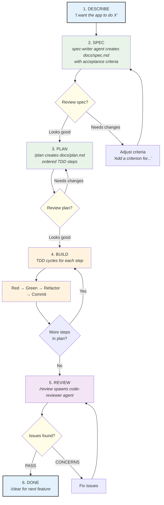
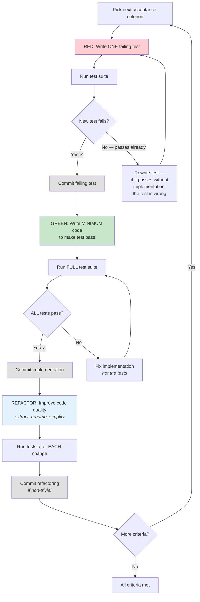

# The Core Workflow

Every feature follows this sequence. No exceptions.

## The TDD Cycle (Step 4 in detail)

Each step in the plan goes through this exact sequence. The TDD skill enforces it automatically.

**Why TDD matters here:** Without tests, Claude's only verification is its own judgment — which degrades as context fills. At 80% accuracy per decision, 20 sequential decisions yield 1.2% overall success. Tests provide ground truth that survives context compaction and session resets.

<!-- NODE-SPECIFIC-START -->
<!-- Add project-specific content below this line. -->
<!-- Hub content above is updated via /scaffold-pull. -->
