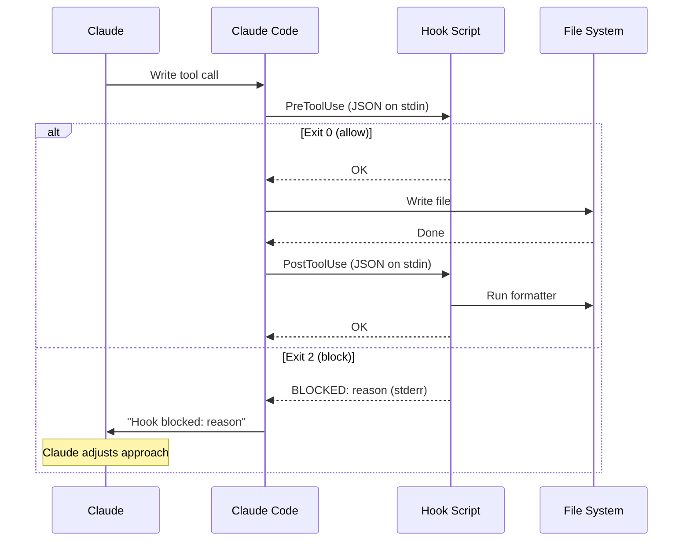
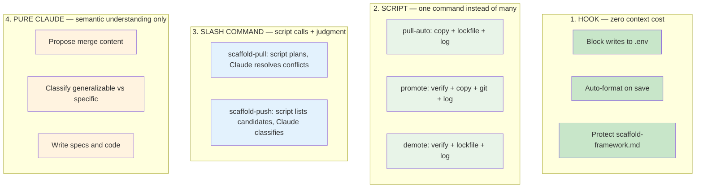

# Hooks System

Hooks are deterministic automation that runs at Claude Code lifecycle events — outside the reasoning loop, at zero context cost. They are the foundation of the deterministic-first principle.

> **Reference:** See `docs/templates/hooks-reference.md` for the complete hook specification including JSON schemas, all event types, and writing conventions.

## How Hooks Work

## Deterministic-First Principle

Every operation falls somewhere on the deterministic-stochastic spectrum. The scaffold enforces this hierarchy:

**The test:** "Can this step produce a wrong answer?" If no → it belongs in a script or hook, not Claude's reasoning.

## Hook vs Rule vs Skill

| Situation | Mechanism | Why |
|-----------|-----------|-----|
| "Never write to .env files" | **Hook** (PreToolUse, exit 2) | Binary file path check, zero context cost |
| "Always format code after writing" | **Hook** (PostToolUse) | Deterministic formatter, zero context cost |
| "Protect scaffold-framework.md" | **Hook** (PreToolUse, exit 2) | Binary check, enforced even if Claude forgets the rule |
| "Follow existing code patterns" | **Rule** | Requires semantic understanding of codebase |
| "Don't add unnecessary dependencies" | **Rule** | Requires judgment about "unnecessary" |
| "Run TDD red-green-refactor cycle" | **Skill** | Multi-step workflow with verification |

## Active Hooks

| Script | Event | Exit 2 blocks | What it checks |
|--------|-------|---------------|----------------|
| `protect-files.sh` | PreToolUse | Yes | `.env`, `*credentials*`, `*secret*`, `*.pem`, `*.key`, `scaffold-framework.md`, `node_modules/`, `dist/`, `generated/`, `.git/` |
| `lint-on-write.sh` | PostToolUse | Yes | Syntax validation: `bash -n` for `.sh`, `jq empty` for `.json`, python yaml check for `.yaml`. Blocks writes with syntax errors. |
| `format-on-write.sh` | PostToolUse | No | Detects file type, runs appropriate formatter (uncomment for your stack) |

## Adding a New Hook

1. Create script in `.claude/hooks/` (use `protect-files.sh` as template)
2. `chmod +x .claude/hooks/my-hook.sh`
3. Add entry to `.claude/settings.json` under the appropriate event
4. Test: `echo '{"tool_input":{"file_path":"test.env"}}' | .claude/hooks/my-hook.sh; echo "exit: $?"`
5. Update this section and `docs/templates/hooks-reference.md`

<!-- NODE-SPECIFIC-START -->
<!-- Add project-specific content below this line. -->
<!-- Hub content above is updated via /scaffold-pull. -->
